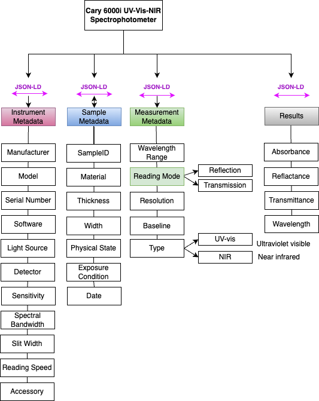

Cary UV Vis Spectrophotometer JSON-LD Description
-----------------------------------
Cary UV Vis Spectrophotometer is a type of optical spectroscopy. In caryUvVis JSON-LD, the experiment is defined by the measurement metadata, which includes the wavelength range, reading mode (reflection or transmission), and resolution.

As important as the experiment metadata is the information about the sample to be analysed, which includes the material type, date, and exposure condition. The results are defined based on the wavelength and absorbance/transmittance/reflectance at that wavelength.

Creating JSON-LD for Cary UV Vis Spectrophotometer in R
------------------------------------------
```{r, message=FALSE, eval=FALSE}
library(FAIRmaterials)

# An example data frame for Cary UV Vis Spectrophotometer
caryUvVis <- data.frame(
  'wavelength' = c('1800', '1691'),
  'absorbance' = c('0.26916054', '0.63266635')
)

# This will generate JSON-LD file for the example data
output <- fairify_data(caryUvVis, domain = 'caryUvVis', saveLocal = TRUE)
```

Creating JSON-LD for Cary UV Vis Spectrophotometer in Python
------------------------------------------
```{python, eval = FALSE, python.reticulate = FALSE}
from fairmaterials.fairify_data import *
import pandas as pd

# An example data frame for Cary UV Vis Spectrophotometer
caryUvVis = pd.DataFrame({
  'wavelength': ['1800', '1691'],
  'absorbance': ['0.26916054', '0.63266635']
})

# This will generate JSON-LD file for the example data
output <- fairify_data(caryUvVis, domain = 'caryUvVis')
```

Cary UV Vis Spectrophotometer schema diagram
--------------------------

```{r, out.width="1200px", echo=FALSE, fig.cap="Cary UV Vis Spectrophotometer schema diagram"}

```


