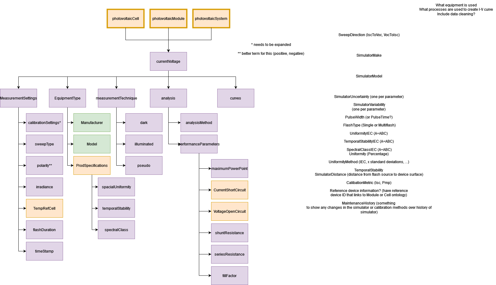

Current Voltage JSON-LD Description
-----------------------------------
This json-ld template is used to store metadata information commonly used to describe the current voltage measurement method. Information is included regarding the measurement type, equipment type, and the various data the is created from the measurement method.

Creating JSON-LD for Current Voltage in R
------------------------------------------
```{r, message=FALSE, eval=FALSE}
library(FAIRmaterials)

# This will generate JSON-LD file for the example data
output <- fairify_data(currentVoltage_example, domain = 'currentVoltage', saveLocal = TRUE)
```

Creating JSON-LD for Current Voltage in Python
------------------------------------------
```{python, eval = FALSE, python.reticulate = FALSE}
import FAIRmaterials

# This will generate JSON-LD file for the example data
output <- fairify_data('currentVoltage_example.csv', domain = 'currentVoltage')
```


Current Voltage schema diagram
--------------------------

```{r, out.width="800px", echo=FALSE, fig.cap="Current Voltage schema diagram"}

```

Acknowledgment
--------------------------
This material is based upon work supported by

* Department of Energy (DOE) - Office of Energy Efficiency and Renewable Energy (EERE) under Solar Energy Technologies Office (SETO): [DE-EE0009347]  
* Department of Energy (DOE) - National Nuclear Security Administration (NNSA): [DOE-NNSA-B6477887].
