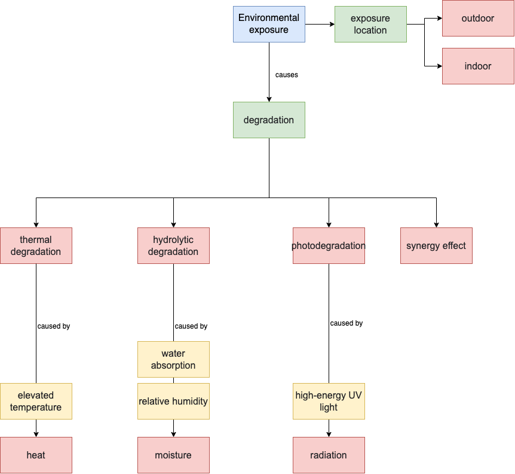

Environmental Exposure JSON-LD Description
-----------------------------------
This json-ld template is used to address multiple environmental stressors that result in material degradation. 

It includes three different degradation processes in addition to a synergy effect.

Creating JSON-LD for Environmental Exposure in R
------------------------------------------
```{r, message=FALSE, eval=FALSE}
library(FAIRmaterials)

# An example data frame for Environmental Exposure
environmentalExposure <- data.frame(
  'temperature' = c('80', '60'),
  'relativeHumidity' = c('85', '85')
)

# This will generate JSON-LD file for the example data
output <- fairify_data(environmentalExposure, domain = 'environmentalExposure', saveLocal = TRUE)
```

Creating JSON-LD for Environmental Exposure in Python
------------------------------------------
```{python, eval = FALSE, python.reticulate = FALSE}
from fairmaterials.fairify_data import *
import pandas as pd

# An example data frame for Environmental Exposure
environmentalExposure = pd.DataFrame({
  'temperature': ['80', '60'],
  'relativeHumidity': ['85', '85']
})

# This will generate JSON-LD file for the example data
output <- fairify_data(environmentalExposure, domain = 'environmentalExposure')
```

Environmental Exposure schema diagram
--------------------------

```{r, out.width="1200px", echo=FALSE, fig.cap="Environmental Exposure schema diagram"}

```


