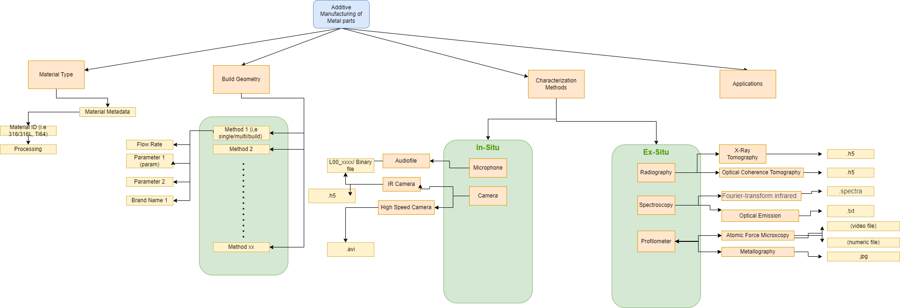

Metal AM JSON-LD Description
-----------------------------------
In Metal Additive Manufacturing (AM) JSON-LD template, the sample information (sample id) is related to printing parameters configure to produce the part, the build geometry of the part, material properties of the part and the characterization techniques (in-situ and ex-situ) performed on the part. 

More detailed structure is shown in the schema diagram below. The purpose of using this JSON-LD template is to create a serialized and searchable template for all Metal AM experimental parameters and conditions that may be searched for and utilized in large scale data analytics.

Creating JSON-LD for Metal AM in R
-----------------------------------
```{r, message=FALSE, eval=FALSE}
library(FAIRmaterials)

# An example data frame for Metal AM 
metalAM_data <- data.frame(
  'sampleID' = c('sa12345', 'sa24682'),
  'printMethod' = c('multi', 'single'),
  'manufacturer' = c('A', 'B'),
  'material' = c('316L', '718Inconel'),
  'laserSpeed' = c(50, 10)
)

# This will generate json-ld files for the example data
metal_output <- fairify_data(metalAM_data, domain = '')
```

Creating JSON-LD for Metal AM in Python
-----------------------------------

```{r, message=FALSE, eval=FALSE}

from fairmaterials.fairify_data import *
import pandas as pd

# create python data frame for Metal AM 

data = {
  'sampleID':['sa12345', 'sa24682'],
  'printMethod' = ['multi', 'single'],
  'manufacturer' = ['A', 'B'],
  'material' = ['316L', '718Inconel'],
  'laserSpeed' = [50, 10]
  
}

am_data = pd.DataFrame(data)

# This will generate JSON-LD file for the example data in Python
fairify_data(am_data,'am_metal')

```

Metal AM schema diagram
-----------------------------------

```{r, out.width="1200px", echo=FALSE, fig.cap="Metal AM schema diagram"}

```

Acknowledgment
-----------------------------------
This material is based upon work supported by the Department of Energy (National Nuclear Security Administration) under Award Number(s) DE-NA0004104.

