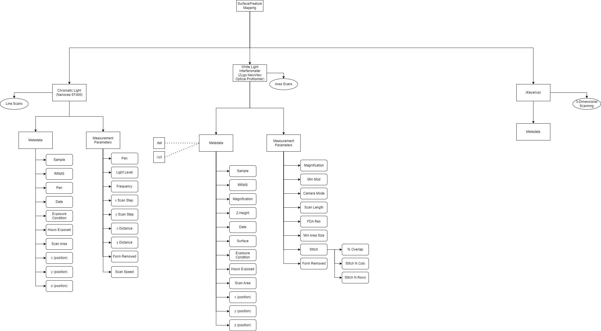

Optical Profilometry JSON-LD Description
-----------------------------------
In Optical Profilometry JSON-LD template, sample identifiers and study metadata 
(exposure conditions and time exposed) is included in addition to information 
gathered during the characterization of the sample via optical profilometry. 
This includes important measurement information such as average roughness (RRMS), 
the form removed from the sample topography, scan magnificationm and whether 
scans were stitched together. A more detailed structure is shown below.

Creating JSON-LD for Optical Profilometry in R
------------------------------------------
```{r, message=FALSE, eval=FALSE}
library(FAIRmaterials)

# An example data frame for Optical Profilometry
opticalProfilometry_data <- data.frame(
  'sampleID' = c('sa12345', 'sa24682'),
  'rrms' = c('0.241', '1.546'),
  'magnification' = c('10x', '2.5x'),
  'formRemoved' = c('Plane', '4th Order Polynomial'),
  'surface' = c('Polyamide', 'Copper'),
  'stitch' = c('Yes', 'No'),
  'stitchNCols' = c(3, NA),
  'stitchNRows' = c(4, NA),
  'exposureCondition' = c('A', 'B'),
  'hoursExposed' = c(100, 1000)
)

# This will generate json-ld files for the example data.
opticalProfilometry_output <- fairify_data(opticalProfilometry_data, domain = 'opticalProfilometry', saveLocal = TRUE)
```

Creating JSON-LD for Optical Profilometry  in Python
------------------------------------------

```{python, eval = FALSE, message = FALSE, python.reticulate = FALSE}
from fairmaterials.fairify_data import *
import pandas as pd

# Create an example data frame for Polymer AM
data = pd.DataFrame(
  'sampleID' = ['sa12345', 'sa24682'],
  'rrms' = ['0.241', '1.546'],
  'magnification' = ['10x', '2.5x'],
  'formRemoved' = ['Plane', '4th Order Polynomial'],
  'surface' = ['Polyamide', 'Copper'],
  'stitch' = ['Yes', 'No'],
  'stitchNCols' = [3, NA],
  'stitchNRows' = [4, NA],
  'exposureCondition' = ['A', 'B'],
  'hoursExposed' = [100, 1000]
)

# This will generate JSON-LD file for the example data
output <- fairify_data(CE_exp, domain = 'opticalProfilometry')
```


Optical Profilometry schema diagram
--------------------------

```{r, out.width="1200px", echo=FALSE, fig.cap="Polymer AM schema diagram"}

```

Acknowledgment
--------------------------
This material is based upon work supported by the Department of Energy (National Nuclear Security Administration) under Award Number(s) 
