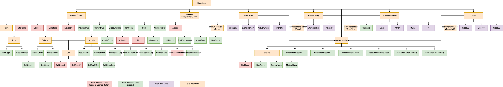

Photovoltaic Polymer Backsheets JSON-LD Description
-----------------------------------
This json-ld template is used to store metadata information commonly used to describe field survey data for degradation analysis of photovoltaic (PV) polymer backsheets. There is information included on the PV site, weather, characterizations data including hand held FTIR, Raman, colorimeter, and gloss meter, and racking to simulate rear side irradiance. Note that a lot of the material included in this json pulls from the OrangeButton Taxonomy. 

Creating JSON-LD for Photovoltaic Polymer Backsheet in R
------------------------------------------
```{r, message=FALSE, eval=FALSE}
library(FAIRmaterials)

# An example data frame for PV Polymer Backsheets
pvbacksheet_example <- data.frame('SiteName' = c('SS-16-7', 'SS-16-7'),
                            'RowName' = c('B01R01', 'B01R02'),
                            'BacksheetMaterial' = c('PVDF', 'PVDF'),
                            'YI' = c('1.1271', '1.0247'),
                            'Gloss60' = c('29.1491', '28.7791'))

# This will generate JSON-LD file for the example data
output <- fairify_data(pvbacksheet_example, domain = 'PolymerBacksheets', saveLocal = TRUE)
```

Creating JSON-LD for Photovoltaic Polymer Backsheet in Python
------------------------------------------
```{python, eval = FALSE, python.reticulate = FALSE}
from fairmaterials.fairify_data import *
import pandas as pd

# An example data frame for PV Polymer Backsheets
pvbacksheet_df = pd.DataFrame({'SiteName': ['SS-16-7', 'SS-16-7'],
                            'RowName': ['B01R01', 'B01R02'],
                            'BacksheetMaterial': ['PVDF', 'PVDF'],
                            'YI': ['1.1271', '1.0247'],
                            'Gloss60': ['29.1491', '28.7791']})
                            
# This will generate JSON-LD file for the example data
output <- fairify_data(pvbacksheet_df, domain = 'PolymerBacksheets')
```


PV Polymer Backsheet schema diagram
--------------------------

```{r, out.width="3200px", echo=FALSE, fig.cap="PV Polymer Backsheet diagram"}

```

Acknowledgment
--------------------------
This material is based upon work supported by the U.S. Department of Energy’s Office of Energy Efficiency and Renewable Energy (EERE) under Solar Energy Technologies Office (SETO) Agreement Number DE-EE0008748.
