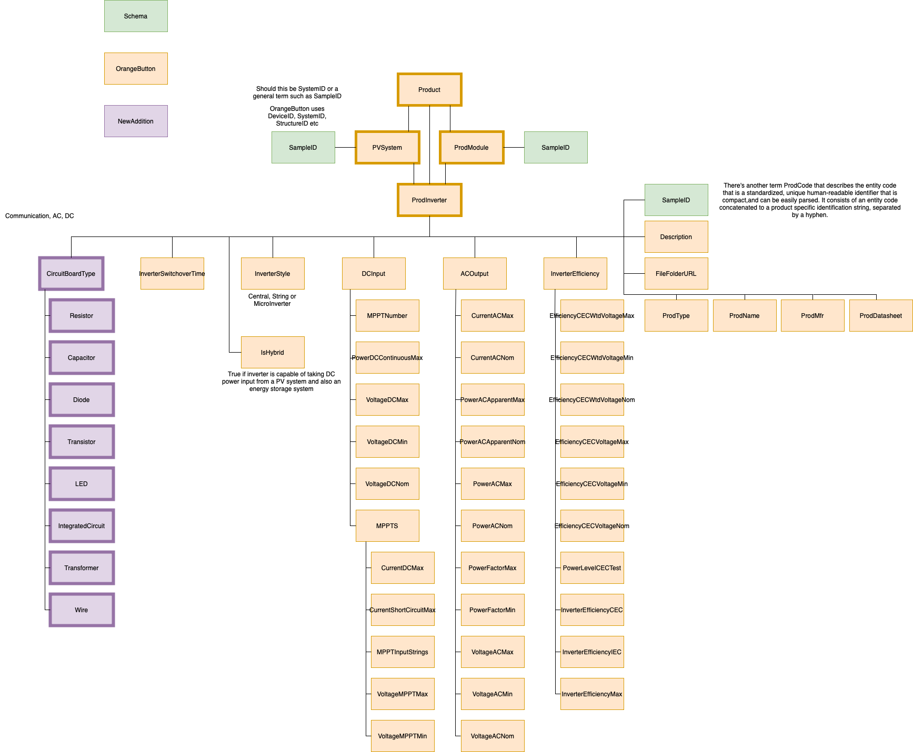

Photovoltaic Inverter JSON-LD Description
-----------------------------------
This json-ld template is used to store metadata information commonly used to describe photovoltaic (PV) inverters There is information included on the PV system, PV module, inverter manufacturer, DC input, AC output and inverter efficiency. Note that a lot of the material included in this json pulls from the OrangeButton Taxonomy. 

Creating JSON-LD for photovoltaicInverter in R
------------------------------------------
```{r, message=FALSE, eval=FALSE}
library(FAIRmaterials)

# This will generate JSON-LD file for the example data
output <- fairify_data(inverter_example, domain = 'photovoltaicInverter', saveLocal = TRUE)
```

Creating JSON-LD for photovoltaicInverter in Python
------------------------------------------
```{python, eval = FALSE, python.reticulate = FALSE}
import FAIRmaterials

# This will generate JSON-LD file for the example data
output <- fairify_data('inverter_example.csv', domain = 'photovoltaicInverter')
```


Photovoltaic Inverter schema diagram
--------------------------

```{r, out.width="800px", echo=FALSE, fig.cap="Photovoltaic Inverter schema diagram"}

```

Acknowledgment
--------------------------
This material is based upon work supported by

* Department of Energy (DOE) - Office of Energy Efficiency and Renewable Energy (EERE) under Solar Energy Technologies Office (SETO): [DE-EE0009347]  
* Department of Energy (DOE) - National Nuclear Security Administration (NNSA): [DOE-NNSA-B6477887].
