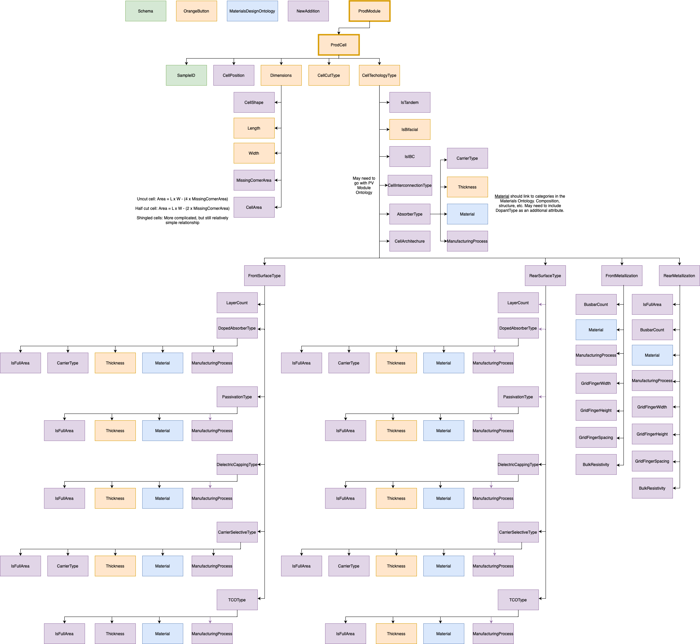

Photovoltaic Cell JSON-LD Description
-----------------------------------
This json-ld template is used to store metadata information commonly used to describe photovoltaic (PV) cell. There is information included on the PV module, cell position, dimension, cell cut type and cell technology type. Note that a lot of the material included in this json pulls from the OrangeButton Taxonomy. 

Creating JSON-LD for PV Cell in R
------------------------------------------
```{r, message=FALSE, eval=FALSE}
library(FAIRmaterials)

# An example data frame for PV Cells
cell_example <- data.frame('CellCutType' = 'Full',
                           'CellTechnologyType' = 'MonoSi')

# This will generate JSON-LD file for the example data
output <- fairify_data(cell_example, domain = 'PVCell', saveLocal = TRUE)
```

Creating JSON-LD for PV Cell in Python
------------------------------------------
```{python, eval = FALSE, python.reticulate = FALSE}
from fairmaterials.fairify_data import *
import pandas as pd

# An example data frame for PV Inverters
inverter_example = {'CellCutType' : 'Full',
                    'CellTechnologyType' : 'MonoSi'}
                    
cell_example = pd.DataFrame(cell_example)

# This will generate JSON-LD file for the example data
output <- fairify_data(cell_example, domain = 'PVCell')
```


PV Cell schema diagram
--------------------------

```{r, out.width="800px", echo=FALSE, fig.cap="PV Cell schema diagram"}

```

Acknowledgment
--------------------------
This material is based upon work supported by

* Department of Energy (DOE) - Office of Energy Efficiency and Renewable Energy (EERE) under Solar Energy Technologies Office (SETO): [DE-EE0009347]  
* Department of Energy (DOE) - National Nuclear Security Administration (NNSA): [DOE-NNSA-B6477887].
