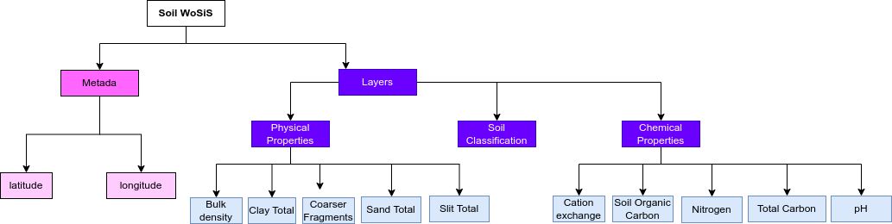

```{r setup, include=FALSE}
knitr::opts_chunk$set(echo = TRUE)
```

Soil data from WoSis JSON-LD Description
-----------------------------------
The [World Data Center for Soils  WDC-Soils](https://www.isric.org/about/world-data-centre-soils-wdc-soils) is an Interdisciplinary Body of the International Science Council (ISC, formerly ICSU). Using FAIR principles, the data is stored ans shared follow procedures/workflows for safeguarding, quality-assessing, standardising / harmonising and serving soil data for the entire world. 
The [WoSiS](https://www.isric.org/explore/wosis/faq-wosis#How_can_i_access_data_derived_from_wosis), standing for World Soil Information Service is a database from WDC that provides soil properties data worldwide coming from different surveys. Some of the properties that can be retrieved are chemical and physical properties such as carbon and nitrogen content, pH, clay content and soil classification. 


Creating JSON-LD for Soil WoSis in R
------------------------------------------
```{r, message=FALSE, eval=FALSE}
library(FAIRmaterials)

# An example data frame for Soil WoSis
soilWosis <- data.frame(
  'lat' = c('41.19893889', '30.02716385'),
  'lot' = c('-84.7444033', '-952579888'),
  'nitrogen' = c('35.56', '60.89'),
  'pH' = c('7.3', '6.8'),
)

# This will generate JSON-LD files for the example data
output <- fairify_data(soilWosis, saveLocal = TRUE)
```

Creating JSON-LD for Soil WoSis in Python
------------------------------------------
```{python, eval = FALSE, python.reticulate = FALSE}
from fairmaterials.fairify_data import *
import pandas as pd

# An example data frame for for Soil WoSis
soilWosis = pd.DataFrame  ('latitude' = ['41.19893889', '30.02716385'],
  'longitude' = ['-84.7444033', '-952579888'],
  'nitrogen' = ['35.56', '60.89'],
  'pH' = ['7.3', '6.8']
  
# This will generate JSON-LD files for the example data and metadata

output =fairify_data(soilWosis, saveLocal = TRUE)

```

Soil from WoSis schema diagram
--------------------------

```{r, out.width="1200px", echo=FALSE, fig.cap="Schema for Soil data from WoSis"}

```

References
--------------------------
https://soilgrids.org/
https://www.isric.org/explore/wosis/faq-wosis#How_can_i_access_data_derived_from_wosis
https://www.isric.org/about/world-data-centre-soils-wdc-soils


Acknowledgment
--------------------------
This material is based upon work in the CASFER National Science Foundation (NSF) Engineering Research Center under the  under Grant No 2133576 sub award 21P735-03


