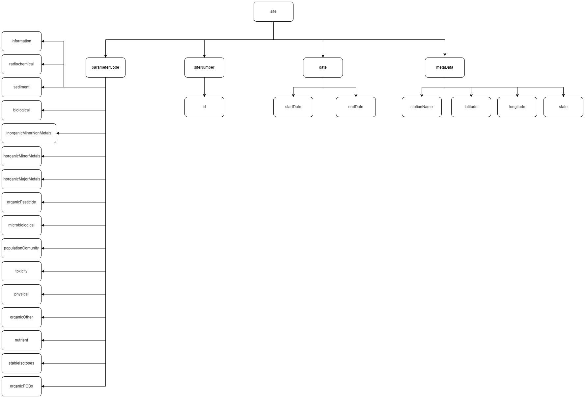

StreamWater(rasterio) JSON-LD Description
-----------------------------------
This JSON-LD Well Log template consists of meta features used to categorize the different water data collected from water gauges by the United States Geological Survey. Examples of meta features include site number, date and parameter codes.

This template is based on the rasterio R package.

Creating JSON-LD for Stream Water(rasterio) in R
------------------------------------------
```{r, message=FALSE, eval=FALSE}
library(FAIRmaterials)

# An example data frame for stream water(rasterio)information
stream_water <- data.frame(
  'siteNumber' = c("01491000","01645000"),
  'date' = c('8-19-1998', '01-30-2002'),
  'parameterCode' = c('sediment', 'information')
)


# This will generate json-ld files for the example data
stream_water_output <- fairify_data(stream_water, domain = 'streamWater')
```

Creating JSON-LD for Stream Water(rasterio) in Python
------------------------------------------

```{python, eval = FALSE, python.reticulate = FALSE}
from fairmaterials.fairify_data import *
import pandas as pd

# An example data frame for stream water(rasterio) data

data = pd.DataFrame (
  'siteNumber' = ['01491000', '01645000'],
  'date' = ['8-19-1998', '01-30-2002'],
  'parameterCode' = ['sediment', 'information'])
   

# This will generate JSON-LD file for the example data in Python
fairify_data(data,'streamWater')
```

 Stream Water(rasterio) schema diagram
--------------------------

```{r, out.width="1200px", echo=FALSE, fig.cap=" Stream Water(rasterio) schema diagram"}

```


References
--------------------------
https://jsonwelllogformat.org/
https://www.energistics.org/energistics-unit-of-measure-standard
https://schema.org/
https://www.iso.org/standard/73830.html

Acknowledgment
--------------------------
This material is based upon work supported by SDLE Research Center 

